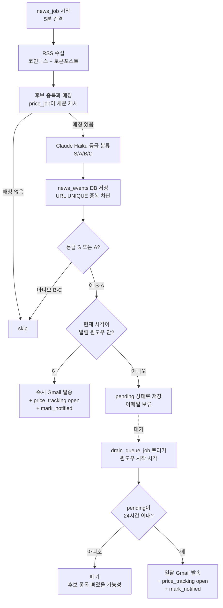

# upbit-news-alert — 프로젝트 개요

> 이 파일은 Claude Code 세션 시작 시 자동 로드됩니다. 프로젝트 본질을 빠르게 파악하기 위한 컨텍스트입니다.

## 한 줄 요약

업비트 KRW 마켓에서 **2~3일 연속 양봉 종목**을 추리고, **코인니스/토큰포스트 RSS**에서 해당 종목의 호재 뉴스를 발견하면 **Claude Haiku로 S/A/B/C 등급 판정 후 S·A급만 Gmail 알림**을 보내는 봇. 발송은 **4개 거래량 피크 시간대 30분 전 윈도우(08:30 / 15:30 / 22:00 / 01:30 KST)** 안에서만 이루어지고, 그 외 시간에 잡힌 호재는 큐잉돼 다음 윈도우 시작 시 일괄 발송. 같은 4시각에 **시장 브리핑 메일**도 슬롯별 라벨(🌅 아침 / 🌆 오후 / 🌃 야간 / 🌙 심야)로 자동 발송. 이후 매일 자정(KST) **4가지 종료 기준**으로 사후 추적을 SQLite에 기록.

## 이 프로젝트는 무엇이 아닌가 (오인 방지)

- **Vercel/Next.js 프로젝트 아님** — Python + Docker + AWS EC2 기반. Vercel 관련 가이드/skill은 무시.
- **거래 봇 아님** — 잔고 조회/주문 X. 업비트 **공개 API만** 사용 (인증 불필요).
- **웹 서비스 아님** — 포트 노출 없음. 백그라운드 스케줄러 (APScheduler).

## 스택

- **언어**: Python 3
- **스케줄러**: APScheduler (가격 모니터 60분, 뉴스 수집 5분, 사후 추적 매일 00:05 KST)
- **AI**: Claude Haiku (Anthropic API) — 뉴스 호재 등급 분류
- **DB**: SQLite (`data/alerts.db`)
- **알림**: Gmail SMTP (App Password)
- **배포**: Docker Compose → AWS EC2 (`52.78.139.118`, coin-trader와 같은 인스턴스 공유)

## 파이프라인 (5단계)

1. **가격 모니터** (`app/upbit.py`, `app/filter.py`) — 60분마다 KRW 마켓 일봉 조회 → 연속 양봉 종목 후보 추출
2. **뉴스 수집 + 분류** (`app/news.py` → `app/classifier.py`) — 5분마다 RSS 스캔 → 후보 종목과 매칭되는 호재 발견 → Claude Haiku로 S/A/B/C 등급
3. **알림 발송 / 큐잉** (`app/jobs.news_job` + `app/notifier.py`) — S·A 등급에 한해:
   - 알림 윈도우 안 (08:30–10 / 15:30–18 / 22–01 / 01:30–04 KST) → 즉시 Gmail 발송
   - 윈도우 밖 → `news_events.notified=0` 상태로 큐잉
4. **드레인 + 브리핑** (`app/jobs.drain_queue_job`, `app/jobs.briefing_job`) — 4개 윈도우 시작 시각(08:30 / 15:30 / 22:00 / 01:30 KST)마다:
   - 대기 중인 pending S·A 일괄 발송 (24시간 초과는 폐기)
   - 슬롯별 시장 브리핑 메일 발송 (movers TOP10 + AI 코멘트 + 후보 종목 + 피크 시간대 표)
5. **사후 추적** (`app/tracker.py`) — 매일 00:05 KST에 활성 트래킹 4기준 평가:
   - `first_red` (첫 음봉)
   - `trailing_drop` (고점 대비 -7%)
   - `below_entry` (본전 이탈)
   - `consecutive_red` (연속 2일 음봉)
   - 같은 인덱스 동시 발생 시 우선순위: `first_red > below_entry > trailing_drop > consecutive_red` (보수적)

## 디렉토리 구조

```
app/
  main.py            # 진입점 (스케줄러 / --once / --dry-run)
  config.py          # 환경 변수 로딩 + ALERT_WINDOWS / DRAIN_TIMES
  upbit.py           # 업비트 공개 API (throttle 120ms + 429 지수 백오프)
  filter.py          # 연속 양봉 필터
  news.py            # RSS 파싱 + 종목명 매핑 (사이클당 1회 빌드)
  classifier.py      # Claude Haiku 등급 분류
  notifier.py        # Gmail SMTP + 피크 시간대 블록 (render_peak_times_block)
  alert_window.py    # 윈도우 진입 판정 (is_in_window / current_window_label)
  tracker.py         # 사후 추적 (4기준)
  jobs.py            # APScheduler 작업 정의 (price/news/track/drain/briefing)
  db.py              # SQLite 스키마 / CRUD / get_pending_alerts
  briefing.py        # 슬롯별 피크 30분 전 브리핑 (4x daily)
  report.py          # 등급별 평균 상승 지속일
  outcome_report.py  # 종료 사유별 상세 리포트
data/alerts.db       # SQLite (3 tables)
tests/               # pytest
scripts/ec2_setup.sh # EC2 최초 셋업
deploy.sh, *.command # 배포 스크립트
Dockerfile, docker-compose.yml
```

## DB 스키마 (`data/alerts.db`, SQLite, 3 tables)

- **news_events** — 매칭된 뉴스 1건 = 1행. `url` UNIQUE (중복 처리 방지). 등급/요약/감지가격 저장.
- **price_tracking** — 알림 발송된 종목별 진행 상태. `entry / peak / closed_at / close_reason`.
- **event_outcomes** — 한 트래킹에 대한 4기준 발생 기록. `criterion` UNIQUE per tracking.

## CLI

| 명령 | 설명 |
|---|---|
| `python -m app.main` | 스케줄러 실행 (블로킹) |
| `python -m app.main --dry-run` | 환경 검증 + 모듈 import 확인 |
| `python -m app.main --once price` | 가격 모니터링 1사이클 |
| `python -m app.main --once news` | 뉴스 수집 + 알림 1사이클 |
| `python -m app.main --once track` | 활성 트래킹 4기준 평가 1사이클 |
| `python -m app.main --once drain` | pending 큐 일괄 발송 1사이클 |
| `python -m app.main --once briefing` | 현재 슬롯 브리핑 메일 1회 발송 |
| `python -m app.report` | 등급별 평균 상승일 통계 |
| `PYTHONPATH=. pytest tests/ -v` | 단위 테스트 |

## 환경 변수 (필수만)

- `ANTHROPIC_API_KEY` — Claude API 키
- `GMAIL_USER`, `GMAIL_APP_PASSWORD`, `EMAIL_RECIPIENT` — Gmail SMTP
- 나머지는 README.md 표 참조 (기본값 있음)

`DRY_RUN=true`면 이메일 대신 로그만 출력.

## 배포 (중요한 함정)

### 권장: `redeploy-local.command` (Mac → EC2 직접 SSH)

GitHub Actions 배포는 **EC2 보안그룹이 GitHub 러너 IP를 차단**해서 `appleboy/ssh-action`에서 `dial tcp ***:22: i/o timeout` 발생. 매주 IP가 바뀌므로 보안그룹에 GitHub Actions IP 추가는 비추천.

따라서 **로컬 Mac에서 EC2로 직접 SSH 푸시**하는 `redeploy-local.command`를 사용. 더블클릭하면 `.env` 업로드 → `git pull` → `docker build` → `docker compose up -d`까지 자동.

`.github/workflows/deploy.yml`은 보안그룹 문제로 매 push마다 실패 알림 발생 — 거슬리면 Actions 탭에서 워크플로 disable.

### EC2 운영 명령

```bash
ssh -i ~/.ssh/coin-trader-key.pem ec2-user@52.78.139.118 \
    "cd ~/upbit-news-alert && docker compose ps && docker compose logs --tail 50 app"
```

### .env 분리 원칙

EC2의 `.env`는 **배포 시 덮어쓰지 않음** (`git reset` 대상에서 제외, `.gitignore`). 로컬 .env와 EC2 .env는 독립적으로 관리.

## 설계 메모

- **인증 불필요**: Upbit 공개 API만 사용 → 401 걱정 없음, 잔고/주문 위험 없음.
- **알림 도배 방지**: `news_events.url` UNIQUE → 같은 URL 재처리 안 함. 추가로 등급 분류 후 S·A만 이메일.
- **종료 기준 4개 동시 기록**: 어떤 게 먼저 발동했는지 추후 백테스트 가능하도록 보존.
- **coin-trader 인프라 재사용**: 같은 EC2 인스턴스에서 별도 컨테이너로 동작. 포트 충돌 없음.

## 알림 시간대 정책 (피크 30분 전 발송 + 큐잉)

### 거래량 피크 시간대 (KST)

| 시간대 | 시장 성격 | 대응 |
|---|---|---|
| 09:00 – 10:00 | 국내 피크 | 일봉 갱신 직후, 당일 급등주 결정 시기 |
| 16:00 – 18:00 | 유럽/아시아 | 박스권 돌파 시도, 오후 수급 유입 |
| 22:30 – 01:00 | 미국 피크 | 거래량 최대, 비트코인 무빙 따라 급변동 |
| 02:00 – 04:00 | 심야 휩쏘 | 거래량은 줄지만 급락/급등(청산) 빈번 |

### 알림 윈도우 (피크 30분 전 ~ 피크 종료)

- **08:30 – 10:00** (국내)
- **15:30 – 18:00** (유럽/아시아)
- **22:00 – 01:00** (미국)
- **01:30 – 04:00** (심야)

### 동작 방식 — **큐잉 (queuing)**

1. `news_job` (5분마다)은 평소대로 RSS 수집 + Claude Haiku 등급 분류 후 DB 저장
2. S·A 등급 발견 시:
   - **알림 윈도우 안이면**: 즉시 이메일 발송 + `price_tracking` open (기존 동작)
   - **윈도우 밖이면**: DB에 `pending` 상태로 저장, 이메일 발송 X
3. 새 잡 `drain_queue_job`: 각 윈도우 **시작 시각**(08:30 / 15:30 / 22:00 / 01:30 KST)에 트리거되어 `pending` 큐를 모아서 한 번에 발송
4. 너무 오래된 pending(예: 24시간 초과)은 자동 폐기 — 후보 종목 자체가 빠졌을 가능성

### 큐잉을 선택한 이유

- **드롭**(윈도우 밖 뉴스 그냥 버림)도 고려했지만:
  - 호재 정보 자체는 가치가 있음 → 버리면 다음 피크 기회까지 놓침
  - 예: 11:00에 발견된 A급 호재 → 드롭하면 15:30 유럽 피크 진입 전 활용 기회를 통째로 놓침
- **즉시 발송**도 고려했지만:
  - 거래량 적은 시간(예: 12:00, 19:00)에 받아도 진입 타이밍 어색
  - "거래량 피크 전에 받아 활용한다"는 본래 의도가 무너짐
- **큐잉**의 결정적 장점:
  - 윈도우 시작 시점에 발송 → 사용자가 받자마자 곧 다가올 피크에서 즉시 활용 가능
  - 한 번에 여러 건 묶여 와도 윈도우 안에서 검토 시간 충분 (윈도우 길이 90분~3시간)

### 주의 사항

- 22:00–01:00 (미국)과 01:30–04:00 (심야) 사이 30분 간격이 있음 — 그 사이는 윈도우 밖으로 취급
- `track_job`(매일 00:05 KST 사후 추적)은 윈도우 정책과 무관, 기존대로 유지
- `DRY_RUN=true`일 때는 윈도우 체크 후에도 로그만 출력 (이메일 발송 안 함)

## 브리핑 메일 (Daily Briefing)

### 발송 시각 — `DRAIN_TIMES`와 동일

피크 30분 전 시점에 자동 발송. 알림 drain과 같은 cron 시각을 공유 (config.DRAIN_TIMES).

| 시각 (KST) | 슬롯 | 이모지 | 의미 |
|---|---|---|---|
| 08:30 | morning | 🌅 아침 브리핑 | 국내 피크(09:00) 30분 전 |
| 15:30 | afternoon | 🌆 오후 브리핑 | 유럽/아시아 피크(16:00) 30분 전 |
| 22:00 | evening | 🌃 야간 브리핑 | 미국 피크(22:30) 30분 전 |
| 01:30 | night | 🌙 심야 브리핑 | 심야 휩쏘(02:00) 30분 전 |

### 본문 구성

- **시장 분위기 카드** — TOP10 평균 변화율로 강세/약세/혼조 판정
- **AI 코멘트** — Claude Haiku가 2문단 한국어 코멘트 (약 400자)
- **주목 종목 칩** — 현재 2~3일 연속 상승 후보 (price_job과 동일 로직)
- **지난 24h S·A 알림** — `news_events`에서 grade IN ('S','A') AND created_at >= now-24h
- **상승률 TOP10 / 하락률 TOP10** — `acc_trade_price_24h` 정렬
- **⏰ 거래량 피크 시간대 표** — 4지역 + NOW/NEXT 배지 (알림 메일과 동일 컴포넌트)

### 슬롯별 차이

본문 데이터 구성은 모두 동일하고, 헤더/제목/푸터 라벨만 슬롯에 따라 바뀜. 예: `🌆 오후 브리핑 — 2026-05-14 15:30 KST (유럽/아시아 피크(16:00) 30분 전)`.

## 운영 노트 / 알려진 이슈

### Upbit API rate limit 방어 (load-bearing)

`app/upbit.py:_get()`은 다음을 강제 적용 — 빼면 즉시 429 폭주로 봇이 무력화됨:

- **호출 간 최소 간격 120ms** (프로세스 전역 `threading.Lock`)
- **429 응답 시 1s/2s/4s 지수 백오프** + 최대 3회 재시도

`app/news.py`의 종목명 매핑은 **사이클당 1번만** 빌드해 `detect_symbols`에 주입. 예전 버그(뉴스 1건마다 `/market/all` 호출 → 사이클당 30회 폭주)는 `build_name_to_symbol_map` 호출 위치를 `news_job` 진입부로 끌어올려 해결됨.

### EC2 보안그룹 SSH IP 차단

`52.78.139.118`의 SSH(22)는 IP 화이트리스트 방식. 사용자 IP가 바뀌면(집 ↔ 사무실 등) 보안그룹에서 인바운드 규칙 추가 필요. GitHub Actions 배포는 러너 IP가 매주 바뀌어 매번 차단됨 → `redeploy-local.command` (Mac → EC2 직접 SSH) 사용이 정답.

### EC2 docker-compose는 plugin 아니라 legacy

EC2에서는 `docker compose` 아닌 `docker-compose`(레거시 바이너리)가 설치돼 있음. 운영 명령은 `docker-compose -f ~/upbit-news-alert/docker-compose.yml ...` 형식으로 사용.

## 아키텍처 다이어그램

### 전체 시스템 (런타임)

```
┌──────────────────────────────────────────────────────────────────┐
│                     EC2 (52.78.139.118)                          │
│  ┌────────────────────────────────────────────────────────────┐  │
│  │         Docker 컨테이너: upbit-news-alert                  │  │
│  │                                                            │  │
│  │  ┌──────────────────────────────────────────────────────┐  │  │
│  │  │             APScheduler (app/main.py) — 11 잡           │  │  │
│  │  │                                                      │  │  │
│  │  │  ┌──────────┐ ┌──────────┐ ┌──────────┐              │  │  │
│  │  │  │price_job │ │news_job  │ │track_job │              │  │  │
│  │  │  │60분 간격 │ │5분 간격  │ │매일00:05 │              │  │  │
│  │  │  └────┬─────┘ └────┬─────┘ └────┬─────┘              │  │  │
│  │  │       │            │            │                    │  │  │
│  │  │  ┌────┴────────────┴────────────┴──────────────────┐ │  │  │
│  │  │  │  윈도우 시작 시각 × 4                            │ │  │  │
│  │  │  │  (08:30 / 15:30 / 22:00 / 01:30 KST)            │ │  │  │
│  │  │  │   ├─ drain_queue_job (pending S/A 일괄 발송)    │ │  │  │
│  │  │  │   └─ briefing_job (슬롯별 시장 브리핑)          │ │  │  │
│  │  │  └─────────────────┬───────────────────────────────┘ │  │  │
│  │  └────────────────────┼─────────────────────────────────┘  │  │
│  │                       ▼                                    │  │
│  │  ┌────────────────────────────────────────────────────┐   │  │
│  │  │           SQLite: data/alerts.db                   │   │  │
│  │  │  news_events / price_tracking / event_outcomes     │   │  │
│  │  └────────────────────────────────────────────────────┘   │  │
│  └────────────────────────────────────────────────────────────┘  │
└────────┬────────────────┬───────────────┬─────────────┬──────────┘
         │                │               │             │
         ▼                ▼               ▼             ▼
   ┌──────────┐    ┌──────────────┐  ┌──────────┐  ┌──────────┐
   │ Upbit    │    │ 코인니스 RSS │  │Anthropic │  │ Gmail    │
   │ 공개 API │    │ 토큰포스트RSS│  │Claude    │  │ SMTP     │
   │(인증 X)  │    │              │  │Haiku API │  │          │
   └──────────┘    └──────────────┘  └──────────┘  └────┬─────┘
                                                        ▼
                                                  EMAIL_RECIPIENT
```

### 뉴스 처리 플로우 (큐잉 분기 포함)



### 알림 윈도우 타임라인 (KST, 24시간)

```
시각: 00───02───04───06───08───10───12───14───16───18───20───22───24
       ▓▓▓▓│░░░░│▓▓▓▓│░░░░│██▓▓│░░░░│░░░░│░░░░│██▓▓▓▓│░░░░│░░░░│▓▓
       │   │    │    │    │    │    │              │              │
       │   01:00─01:30                             │              │
       │   (30분 갭)                                │              22:00 미국 윈도우 진입
       │                                            15:30 유럽 윈도우 진입
       │                                  
       └─ 00:00 ~ 01:00 : 전날 22:00에 시작된 미국 윈도우 연장
          01:30 ~ 04:00 : 심야 휩쏘 윈도우
          08:30 ~ 10:00 : 국내 윈도우
          15:30 ~ 18:00 : 유럽/아시아 윈도우
          22:00 ~ 24:00 : 미국 윈도우 시작 (다음날 01:00까지)

  ██ = 피크 시간대          ▓▓ = 30분 사전 윈도우          ░░ = 윈도우 밖 (pending)

drain_queue_job 트리거 시각 (▼):
   ▼─────────────────────────▼──────────────────▼─────────────▼
   01:30                     08:30              15:30         22:00
   심야 진입                 국내 진입          유럽 진입     미국 진입
```

### 데이터 흐름 (하루 예시)

```
07:55  RSS에서 BTC 호재 발견 → 등급 A → 윈도우 밖 → DB pending 저장 (이메일 X)
08:25  RSS에서 ETH 호재 발견 → 등급 S → 윈도우 밖 → DB pending 저장 (이메일 X)
08:30  ▼ 동시 트리거 ▼
       └─ drain_queue_job → pending BTC(A), ETH(S) 일괄 발송 ✉️✉️
           + 각자 price_tracking open
       └─ briefing_job → 🌅 아침 브리핑 메일 발송 ✉️ (movers + AI 코멘트)
08:35  news_job 정상 동작 — 윈도우 안이므로 새로 발견되면 즉시 발송
...
10:00  국내 윈도우 종료 → 이후 발견되는 S·A는 다시 pending
...
15:30  ▼ drain_queue_job + 🌆 오후 브리핑 동시 발송 ✉️
22:00  ▼ drain_queue_job + 🌃 야간 브리핑 동시 발송 ✉️
...
00:05  track_job (매일 자정 직후) — 활성 트래킹 4기준 평가 (윈도우 정책 무관)
01:30  ▼ drain_queue_job + 🌙 심야 브리핑 동시 발송 ✉️
```
